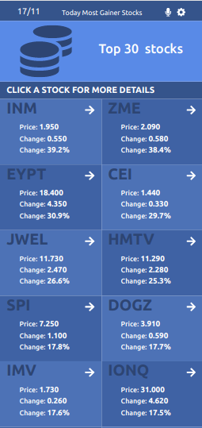

# Stocks Metrics

> A React-Redux stock metrics application.
Get the best-performing stocks daily see stocks prices, their changes, and the most useful information of each stock.

## Live Demo

https://stock-metrics-miki.herokuapp.com/

## Built With

- JavaScript
- React
- Redux
- Jest

## Getting Started

To get a local copy up and running follow these simple example steps.

### Prerequisites
 A modern web browser (Chrome, Firefox, Safari, Microsoft Edge)

### Usage
 Clone the project by typing in your terminal `git clone https://github.com/mike2611/metrics-webapp.git`.

 Change directory `cd` into the just created from the project.

 Run `npm install`.
 
 Run `npm start`.

 Your computer will open the main page where you can add your name and score
 
## Run tests
 Clone the project using `git clone https://github.com/mike2611/metrics-webapp.git`.

 Run `npm run test`.

## Authors

👤 **Miguel Angel Puentes**
- GitHub: [@mike2611](https://github.com/mike2611)
- Twitter: [@MiguelP2611](https://twitter.com/MiguelP2611)
- LinkedIn: [Miguel Puentes Mata](https://linkedin.com/in/miguel-puentes-mata-90a562139/)

Contributions, issues, and feature requests are welcome!

Feel free to check the [issues page](https://github.com/mike2611/spaceships.git/issues).

## Show your support

Give a ⭐️ if you like this project!

## Acknowledgments
- [Financial Modeling Prep API Documentation](https://site.financialmodelingprep.com/developer/docs/?gclid=CjwKCAiA7dKMBhBCEiwAO_crFHVfCV0OuWi0qkdp2uH_lJ4eL3zQWvqr0gDolVaiguy1pE4mqUOzmRoCdIgQAvD_BwE)

- [Original design idea by Nelson Sakwa on Behance.](https://www.behance.net/gallery/31579789/Ballhead-App-(Free-PSDs))

- JavaScript and React best practices
- API consumption
- Redux-Thunk utilization
- Mock testing for React components

